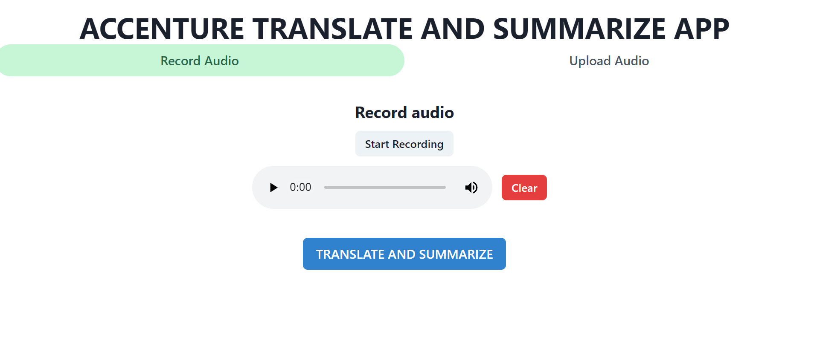

# OpenAI API Whisper Demo- Node.js example app

This is an example Speech to text app who uses Whisper through the openAI API. It uses the [Next.js](https://nextjs.org/) framework with [React](https://reactjs.org/). Follow the instructions below to get set up.



## Setup

1. If you don’t have Node.js installed, [install it from here](https://nodejs.org/en/) (Node.js version >= 14.6.0 required)

2. Clone this repository

3. Navigate into the project directory

   ```bash
   $ cd Whisper_web_demo
   ```

4. Install the requirements

   ```bash
   $ npm install
   ```

5. Create a .env file at the root of the project

6. Add your [API key](https://platform.openai.com/account/api-keys) to the newly created `.env` file
    ```format must be
   OPENAI_API_KEY=YOUR_KEY
   ```

7. Run the app

   ```bash
   $ npm run dev
   ```
You should now be able to access the app at [http://localhost:3000](http://localhost:3000)!

## Warning

The backend function stores audio  in your /tmp directory 

